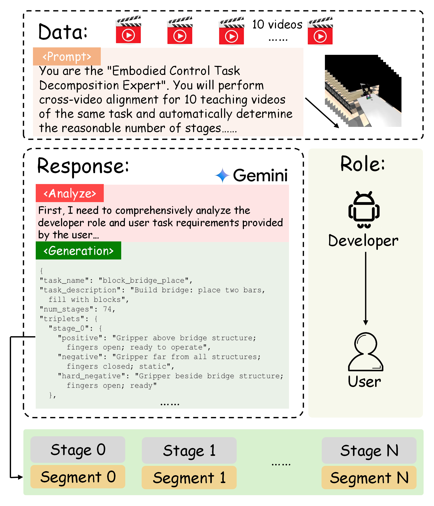
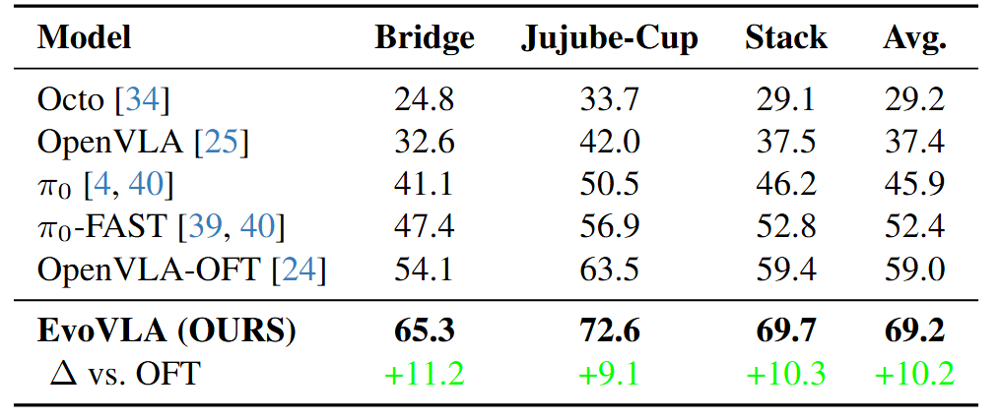
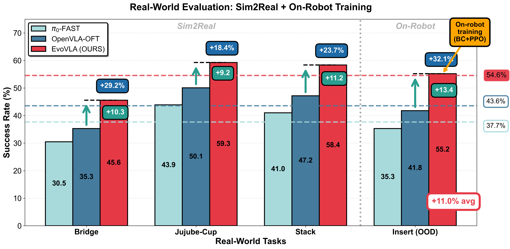

#  EvoVLA: Self-Evolving Vision-Language-Action Model

[](https://arxiv.org/abs/2511.16166)
[](https://aigeeksgroup.github.io/EvoVLA/)
[](https://huggingface.co/AIGeeksGroup/EvoVLA)
[](https://huggingface.co/datasets/AIGeeksGroup/Discoverse-L)
[](LICENSE)

This is the official repository for the paper:
> **EvoVLA: Self-Evolving Vision-Language-Action Model**
>
> [Zeting Liu](https://github.com/ZetingLiu)\*, [Zida Yang](https://github.com/yzd2002)\*, [Zeyu Zhang](https://steve-zeyu-zhang.github.io/)\*<sup>†</sup>, and [Hao Tang](https://ha0tang.github.io/)<sup>#</sup>
>
> \*Equal contribution. <sup>†</sup>Project lead. <sup>#</sup>Corresponding author.
>
> ### [Paper](https://arxiv.org/abs/2511.16166) | [Website](https://aigeeksgroup.github.io/EvoVLA/) | [Data](https://huggingface.co/datasets/AIGeeksGroup/Discoverse-L) | [Models](https://huggingface.co/AIGeeksGroup/EvoVLA) | [HF Paper](https://huggingface.co/papers/2511.16166)

---


https://github.com/user-attachments/assets/20ea6d5a-5fcb-4b72-a008-1e94224bf5ed


## 🔗 Citation

If you find our work helpful, please cite:

```bibtex
@article{liu2025evovla,
  title={EvoVLA: Self-Evolving Vision-Language-Action Model},
  author={Liu, Zeting and Yang, Zida and Zhang, Zeyu and Tang, Hao},
  journal={arXiv preprint arXiv:2511.16166},
  year={2025}
}
```

---

<div align="center">
  
</div>

## 🎥 Demo Video

<div align="center">
  <a href="https://github.com/AIGeeksGroup/EvoVLA/raw/main/demo_video.mp4">
    
  </a>
  <br>
  <p>☝️ <strong>Click the image above to watch the High-Res Demo Video (1080P)</strong> ☝️</p>
</div>

---

## 📖 Abstract: Ending the Robot's "Daydream"

In long-horizon manipulation tasks, robots often suffer from **"Stage Hallucination"**: they *think* they've completed a step because the visual scene looks "close enough," but they haven't actually finished the job (e.g., a block is near the target but not stacked). This "high confidence, low competence" failure mode causes catastrophic task failure.

**EvoVLA** is a self-evolving framework designed to cure this hallucination. By treating **Gemini 2.5 Pro** as a strict teacher that generates "Hard Negatives" (near-miss scenarios), EvoVLA learns to distinguish between *almost done* and *actually done*.

Combined with **Pose-Based Object Exploration (POE)** and **Long-Horizon Memory**, EvoVLA achieves **SOTA performance** on the challenging **Discoverse-L** benchmark.

---

## 🚀 Key Features

### 1. Stage-Aligned Reward (SAR): The "Anti-Hallucination" Mechanism
Traditional rewards are too sparse. We use Gemini to generate a **"Mistake Book"** of Hard Negatives—states that *look* successful but are actually failures (e.g., "gripper near object but not touching").
*   **Positive**: "Gripper firmly grasping the block."
*   **Hard Negative**: "Gripper near the block, but fingers are empty."
This forces the VLA to learn precise, stage-aware visual discrimination.

<div align="center">
  
  <p><em>Figure: The EvoVLA Data Engine generating triplets for contrastive learning.</em></p>
</div>

### 2. Pose-Based Object Exploration (POE)
Instead of being curious about pixel changes (which can be noisy shadows or lighting), EvoVLA's curiosity is grounded in **geometry**. It explores how to change the *relative pose* between the gripper and the object, leading to efficient, structure-aware discovery.

### 3. Long-Horizon Memory
For tasks with 70+ steps, simple memory averaging fails. EvoVLA uses **Context Selection** to recall only the critical history tokens needed for the current decision, preventing "catastrophic forgetting."

---

## 📊 Performance

### Simulation Results (Discoverse-L)
EvoVLA dominates across three tasks of increasing difficulty, especially on the 74-stage **Block Bridge** task.

<div align="center">
  
  <p><em>Figure: Success rates on Discoverse-L benchmark. EvoVLA (Purple) significantly outperforms OpenVLA and π0.</em></p>
</div>

*   **Success Rate**: **69.2%** (+10.2% vs OpenVLA-OFT)
*   **Hallucination Rate**: Reduced from 38.5% to **14.8%**
*   **Sample Efficiency**: **1.5x** faster convergence

### Real-World Sim2Real Transfer
Deployed on the **AIRBOT-Play** robot, EvoVLA shows remarkable robustness.

<div align="center">
  
  <p><em>Figure: Real-world deployment performance.</em></p>
</div>

### Qualitative Analysis: "No More Faking It"
<div align="center">
  
  <p><em>Figure: OpenVLA (Top) opens the gripper too early (hallucination). EvoVLA (Bottom) waits for stable contact.</em></p>
</div>

---

## 🛠️ Quick Start

### Installation
```bash
# Clone the repository
git clone https://github.com/AIGeeksGroup/EvoVLA.git
cd EvoVLA

# Create environment
conda create -n evovla python=3.10
conda activate evovla

# Install dependencies
pip install -r requirements.txt
```

### Training
```bash
# Train on Discoverse-L Bridge Task
python train.py --config configs/evovla_bridge.yaml
```
